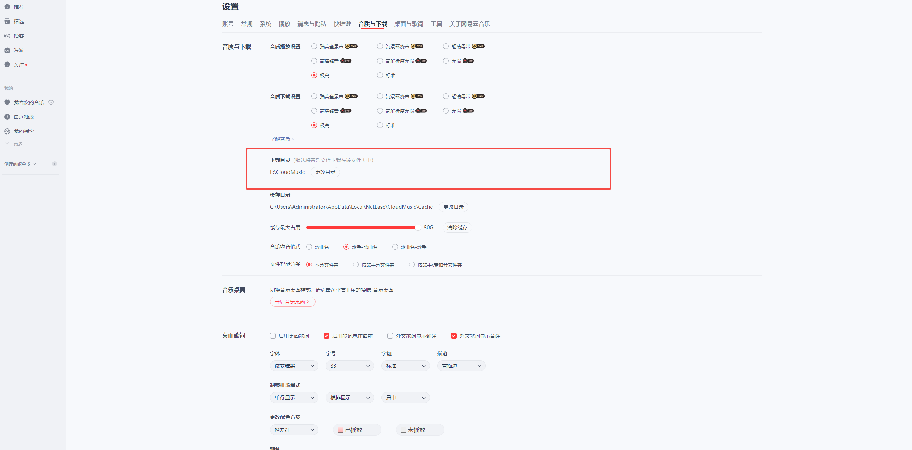
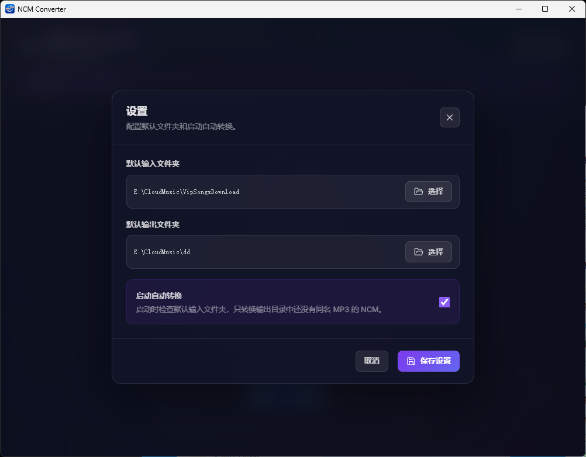

# NCMToMP3ForWangYiYun

一个把网易云音乐本地下载的 `.ncm` 文件解析为 MP3 文件的桌面工具，支持 ID3 标签提取，全程本地运行，快速解析。

本项目使用 Svelte、Vite、Tauri 2 和 Rust 构建。

## 直接使用

不需要本地编译的用户，可以在 GitHub Releases 中获取 Windows 安装包。

## 如何转换

1. 打开网易云音乐客户端，找到需要转换的歌曲下载目录。



2. 启动本工具，点击“选择文件”或“选择文件夹”，选择本地 `.ncm` 文件或包含 `.ncm` 文件的目录。



3. 如需指定保存位置，点击右上角文件夹按钮选择输出目录；如果不指定，默认输出到源 `.ncm` 文件所在目录。

4. 点击“开始转换”，等待转换完成。


5. 转换成功后，可以在输出目录中找到生成的 MP3 文件。可用音乐播放器打开，封面、标题、歌手、专辑等 ID3 信息会尽量自动写入。


## 功能

- 支持转换单个 `.ncm` 文件或整个文件夹。
- 在元数据可用时，将标题、歌手、专辑、封面和歌词写入输出 MP3 的 ID3 标签。
- 支持嵌入与源 `.ncm` 文件同名、位于同一目录下的 `.lrc` 或 `.irc` 歌词文件。
- 支持设置默认输入文件夹和输出文件夹。
- 支持启动时自动扫描并转换新增文件。

## 环境要求

- Node.js 18 或更新版本。
- Rust stable 工具链。
- Windows WebView2 Runtime。
- 目标平台所需的 Tauri 系统依赖。

## 本地开发

```bash
npm install
npm run tauri:dev
```

## 构建

```bash
npm run tauri:build
```

Windows 安装包会生成在：

```text
src-tauri/target/release/bundle/
```

## 项目结构

```text
src/                       Svelte 前端入口
src/app/                   前端文件队列、转换调用和设置工具
src/components/            UI 组件
src-tauri/src/commands.rs  Tauri 命令入口
src-tauri/src/conversion.rs 转换流程编排
src-tauri/src/id3_tags.rs  MP3 ID3 标签写入
src-tauri/src/lyrics.rs    同名歌词文件读取
src-tauri/src/ncm.rs       NCM 解密和元数据解析
src-tauri/src/scanner.rs   NCM 文件扫描
src-tauri/src/settings.rs  设置文件读写
src-tauri/icons/           应用图标
src-tauri/capabilities/    Tauri 权限配置
```

## 说明

本项目仅用于处理你有权处理的本地文件。请勿使用本项目重新分发受版权保护的音乐，也请遵守相关服务条款。本项目与网易云音乐没有关联。

## 许可证

MIT License © Mussy
